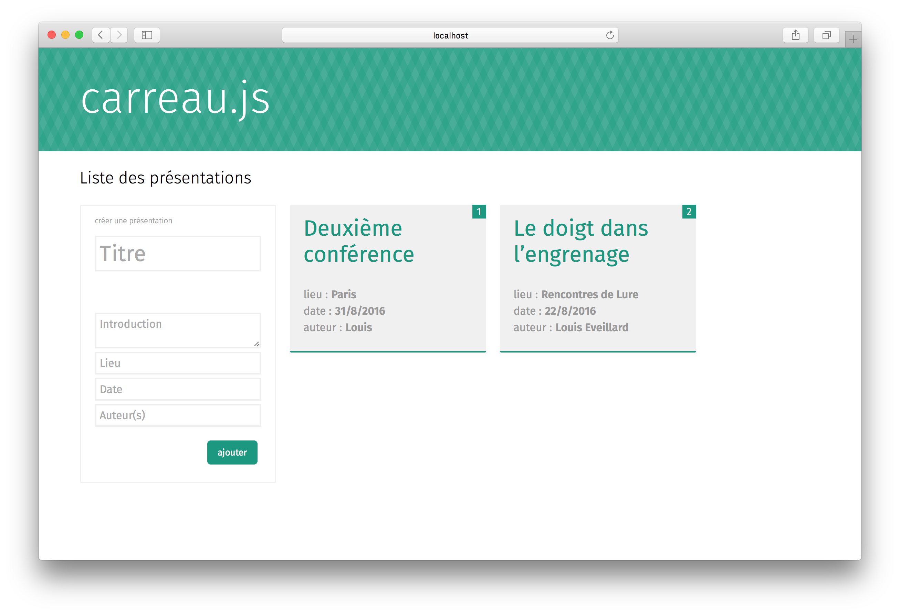

<!--
N.B.: This README was automatically generated by <https://github.com/YunoHost/apps/tree/master/tools/readme_generator>
It shall NOT be edited by hand.
-->

# Carreau for YunoHost

[](https://ci-apps.yunohost.org/ci/apps/carreau/)  

[](https://install-app.yunohost.org/?app=carreau)

*[Read this README in other languages.](./ALL_README.md)*

> *This package allows you to install Carreau quickly and simply on a YunoHost server.*  
> *If you don't have YunoHost, please consult [the guide](https://yunohost.org/install) to learn how to install it.*

## Overview

This is a dummy description of this app features


**Shipped version:** 1.0.0~ynh1

## Screenshots



## Documentation and resources

- Upstream app code repository: <https://github.com/l-atelier-des-chercheurs/carreau.js>
- YunoHost Store: <https://apps.yunohost.org/app/carreau>
- Report a bug: <https://github.com/YunoHost-Apps/carreau_ynh/issues>

## Developer info

Please send your pull request to the [`testing` branch](https://github.com/YunoHost-Apps/carreau_ynh/tree/testing).

To try the `testing` branch, please proceed like that:

```bash
sudo yunohost app install https://github.com/YunoHost-Apps/carreau_ynh/tree/testing --debug
or
sudo yunohost app upgrade carreau -u https://github.com/YunoHost-Apps/carreau_ynh/tree/testing --debug
```

**More info regarding app packaging:** <https://yunohost.org/packaging_apps>
